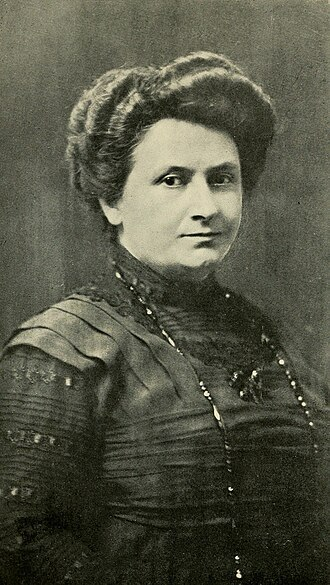

## Wer war Maria Montessori? ## 

Am 31. August 1870 wird Maria Montessori in Italien geboren. Nachdem sie 1896 als eine der ersten Ärztinnen Italiens
promoviert hat, widmet sie sich wissenschaftlichen Studien über die Entwicklung von benachteiligten Kindern und deren
Förderung durch eigens entwickelte Lernmaterialien.

Im Jahr 1907 übernimmt sie die Leitung des ersten Kinderhauses, genannt Casa dei Bambini, für Kinder im Alter von drei
bis sechs Jahren. Dort bringt sie ihre Überlegungen zur Förderung der kindlichen Entwicklung in die tägliche
Erziehungspraxis ein und beobachtet mit wachsender Faszination, wie sich eine anspruchsvoll gestaltete Umgebung positiv
auf das Lernen der Kinder auswirkt. Von diesem Zeitpunkt an ist es ihr Ziel, Übungsmaterialien zu finden, die die
ganzheitliche Entwicklung der Kinder stimulieren. Sie beschreibt die Rolle des Erwachsenen bei der Präsentation des
Materials und der Förderung der kindlichen Entwicklung. Sie schreibt Bücher, die in viele Sprachen übersetzt werden und
ihre entwicklungspsychologische und pädagogische Sichtweise auf das Kind sowie die darauf basierenden Materialien und
Methoden weltweit bekannt machen. Weltweit werden Montessori-Kinderhäuser und Montessori-Schulen gegründet. Maria
Montessori hält Einführungskurse und unternimmt zahlreiche Vortragsreisen.

Im Jahr 1939 flieht sie vor dem Faschismus aus Italien und lebt und lehrt in Indien. Nach dem Ende des Zweiten
Weltkriegs kehrt sie nach Europa zurück und reist bis zu ihrem Tod im Jahr 1952 durch verschiedene Länder, um ihr Wissen
und ihre Ideen zu verbreiten. Am 6. Mai 1952 verstirbt Maria Montessori in Nordwijk aan Zee in den Niederlanden. Ihr
Erbe in Form ihrer pädagogischen Methode und ihrer Materialien lebt jedoch weiter und beeinflusst bis heute die Bildung
und Erziehung von Kindern auf der ganzen Welt.
